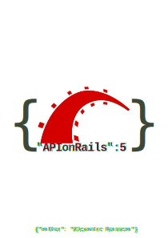

<<<<<<< HEAD
# 
=======
# 
>>>>>>> master

Update & translation of the [API on Rails (EN)](http://apionrails.icalialabs.com/book) book.

<noscript></noscript>

## Export as PDF, epub, HTML, etc..

You should install and use [pandoc](http://pandoc.org/). Clone the project & this is simply as this:

~~~bash
$ cd fr
$ pandoc *.md -o api-on-rail-fr.pdf
~~~

## License

This book is under [MIT license](https://opensource.org/licenses/MIT) and [Creative Common BY-SA 4.0](https://creativecommons.org/licenses/by-sa/4.0/)
